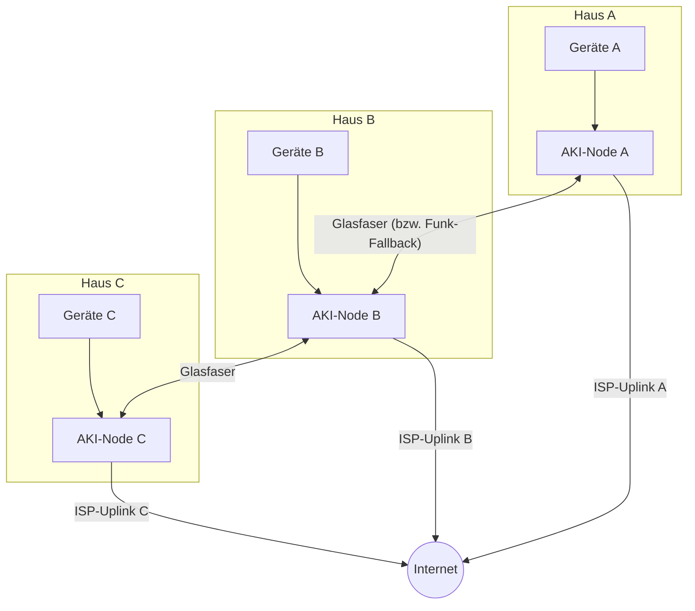
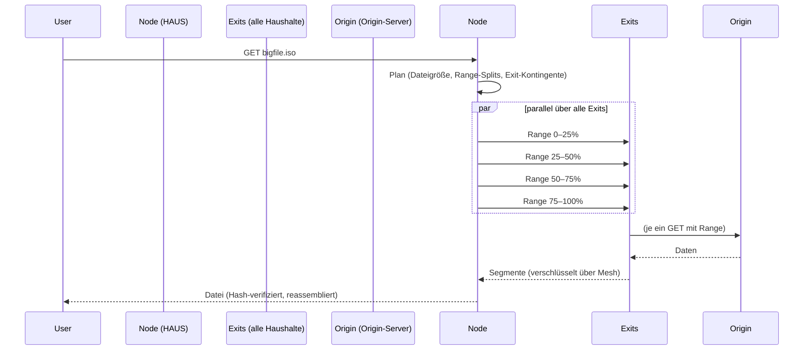

# Architektur

Von unten (Physik) nach oben (Inhalte). Der AKI-Node ist das Herzstück —
eine kleine Box im Wohnungsregal, die zu Hause sitzt und das Viertel verbindet.

## Übersicht

Entscheidend: **jeder Haushalt behält seinen eigenen Uplink**. Es gibt keinen
zentralen Exit (anders als klassische Community-Meshes mit einem Supernode),
sondern viele — das verteilt nicht nur Last, sondern auch Risiko und Zensur-
Angriffsfläche.

## Schicht 0 — Physik (Nachbarschaftsglasfaser)

- **Bevorzugt:** Glasfaser Haus-zu-Haus (z. B. 2-Faser-Duplex G.657A2, LC-
  Stecker), Medienwandler bzw. SFP-Port direkt im Node. Innenrohr entlang
  der Fassade, kurze Gräben im Garten, Kabelkanal.
- **Pragmatisch für den Start:** was da ist — existierendes LAN-Kabel im
  Mehrfamilienhaus (bis 100 m), Richtfunk 60-GHz-PTP (5–15 Gbit/s,
  Sichtlinie nötig) als Überbrückung.
- **Topologie:** anfangs Stern/Ring (2–5 Häuser), später vermascht. Jede
  Faser ist ein separates Link; Redundanz schlägt Eleganz.

## Schicht 1 — Routing (Overlay über alle Haushalte)

Kandidaten (Auswahl offen, Kriterium: simpel, wartbar, verschlüsselt):

| Kandidat | Pro | Con |
|---|---|---|
| **Yggdrasil** | Out-of-the-box e2e-verschlüsseltes IPv6-Overlay, null Konfiguration, self-contained | experimentell, Performance über wenige Gbit/s hinaus |
| Babel + WireGuard | bewährt (Althea-Ansatz), Router-Hardware tauglich | mehr Konfigurationsaufwand |
| cjdns | Battle-tested in Hyperboria | ältere Codebasis |

Empfehlung für den PoC: **Yggdrasil**. Jeder AKI-Node peert über die
Glasfaser-Links mit seinen Nachbarn; Geräte der Haushalte hängen per NAT/
Firewall getrennt dahinter (Home-LAN ≠ Mesh-LAN).

## Schicht 2 — Bandbreiten-Pooling (der eigentliche Kern)

### Exit-Pool

Jeder Haushalt bietet seinem Node an, wie viel Uplink er "spendiert"
(Kontingent, standardmäßig fair-share). Der Exit-Pool ist die aggregierte
Kapazität. Exit ist **opt-in pro Haushalt und jederzeit widerruflich**.

### Leech-Modus

Wer seinen Uplink nicht teilen will (oder kann), schaltet Sharing einfach
aus und läuft im **Leech-Modus**: rein empfangen, nichts beitragen. Das ist
ausdrücklich legitim — "Netz unter Nachbarn" heißt Nachsicht, nicht
Gegenseitigkeitszwang. Technisch gilt:

- Leeched Nodes bekommen im Fairness-Scheduler die niedrigste (aber
  weiterhin faire) Priorität, wenn Kapazität knapp ist.
- Bei Überlast wird Leeched-Nodes zuerst gedrosselt, ohne sie auszuschließen.
- Der Status ist sichtbar (Karma/Anzeige), aber es gibt keine Strafe und
  keine Zwangsfreischaltung.

### Segmentierter Multi-Exit-Download (`aki-fetch`)

- HTTP Range Splits + Shadow-Verifizierung (Content-Hash)
- Fallback: entfällt ein Exit, übernimmt ein anderer das Segment
- Für nicht-rangefähige Quellen: klassische Proxy-Rotation

### Generischer Traffic (alles andere)

VPN-artiges Overlay: pro Gerät ein verschlüsselter Tunnel zu *einem*
gewählten Exit, Exit-Wahl rotiert; Browsing/Video-Calls laufen über einen
Exit, große Transfers über alle. Video-Calls werden explizit auf einen
Exit gepinnt (kein Splitting).

### Fairness-Scheduler (`aki-fair`)

- Max-min Fairness über alle aktiven Nutzer:innen des Netzes
- Exit-Kontingente (Volumenlimit, Wartungszeit) werden respektiert
- Karma statt Bezahlung: wer dauerhaft deutlich mehr zieht als er gibt,
  wird fair angesprochen (Drosselung als letztes Mittel, nie als Strafe
  für Berechtigte mit Bedarf)

### Nachbarschafts-Cache (`aki-cache`)

- Transparenter Shared-Cache (lancache-Prinzip): große, popluläre Objekte
  (Steam, Konsolen-Updates, OS-Images, Software-Pakete) kommen aus dem
  Viertel statt aus dem Internet
- DNS-basiert, pro Haushalt kleine Cache-Slots; gemeinsam sind sie groß

## Schicht 3 — Inhalte & Apps (Freenet)

- `freenet-core` (Rust, AGPL-3.0) läuft als Sidecar auf ausgewählten Nodes
  und stellt verteilte Inhalte/Apps im Viertel bereit: Nachbarschafts-Wiki,
  Microblogging, lokale Services — ohne zentralen Server, auch offline
  erreichbar.
- Freenet ist **keine Anonymitätslösung** (siehe FAQ) und wird auch nicht
  als solche beworben.
- Unsere Software nutzt Freenet über `freenet-stdlib` bzw. die
  WebSocket-API (nicht-derivativ), unsere eigene Codebasis bleibt AGPL-3.0.

## Sicherheit und Vertrauen

- Nodes authentifizieren sich gegenseitig per Keypair; Onboarding im
  persönlichen Gespräch (Nachbar:innen sind der Trust-Anchor, nicht PKI).
- Strikte Netz-Trennung: Mesh-LAN hat keinen Zugriff auf Home-LAN der
  Teilnehmer (Client-Isolation).
- Kill-Switch: jeder Haushalt kann seine Faser physisch/softwareseitig
  abklemmen; der Node fällt auf "nur eigener Anschluss" zurück.
- Minimale Logs (DSGVO, siehe [recht.md](recht.md)).

## Offene Fragen

- DSLite/Carrier-NAT-Haushalte: Synchrone Exits gehen, aber
  Konfigurationsaufwand pro Router-Modell prüfen.
- ISP-AGB: Weitergabe an "Dritte" kann verboten sein (per ISP prüfen,
  siehe recht.md).
- Wie viel Cache lohnt sich real bei 3–10 Haushalten? (Messung in Phase 2)
