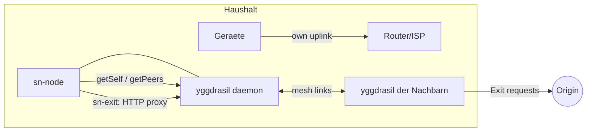

# Overlay: Yggdrasil

Wie die Häuser untereinander erreichbar werden, bevor irgendwas gepoolt
wird. Stand: konzeptionell entschieden (erste Wahl), `sn-node`-Anbindung
begonnen (siehe [[Server-README]]).

## Warum Yggdrasil?

[Yggdrasil](https://yggdrasilnetwork.github.io/) ist ein
**self-contained Userspace-Router**: Jeder Node bekommt eine stabilen
IPv6-Adresse im `200::/7`-Raum, Nodes verbinden sich zu einem
end-to-end-verschlüsselten Overlay (Routing über einen
Spanning-Tree), egal ob Glasfaser, LAN, WLAN oder Internet dazwischen
liegt.

Pro:

- **Out-of-the-box verschlüsselt** — Peering-Verbindungen sind
  kryptographisch gesichert, ohne extra WireGuard-Stapel
- **Null Konfiguration fürs Peering**: auf demselben LAN (also über die
  Nachbarschafts-Faser oder den Keller-Switch) finden sich Nodes per
  Multicast automatisch
- **Link-agnostisch** wie SpiderNet selbst: tcp://, tls://, quic://
  Listener und Peer-URIs, Funk/LAN/Faser egal
- **Feste Adresse pro Keypair** — die Node-Adresse bleibt, solange der
  Schlüssel bleibt (wichtig für Exit-Zuteilung und Nachbarschafts-ACL)
- **`AllowedPublicKeys`**: nur gelistete Nachbarn dürfen peeren —
  das Nachbarschafts-Vertrauen wird direkt vom Overlay erzwungen
- Single Rust/CPU-Binary, läuft auf Mini-PCs und Einplatinen

Contra (ehrlich benannt):

- Experimenteller als Babel; Performance-Obergrenze liegt deutlich
  unter der, die dichte Glasfaser theoretisch bieten könnte — für
  Phase 1 (2–3 Haushalte) völlig ausreichend, Messwerte dokumentieren
- Wenn das Overlay zum Flaschenhals wird: Babel + WireGuard als
  Ausweich-Kandidat (siehe [[Architektur]], Schicht 1)

## Rollen im SpiderNet-Node

1. **yggdrasil-Daemon** (Prozess/Sidecar, nicht von uns implementiert):
   bildet das Overlay, jede Faser wird zur Overlay-Verbindung.
2. **sn-node** (unser Daemon): generiert die yggdrasil.conf aus
   validierten Einstellungen, fragt den Admin-Socket ab (Node-Adresse,
   Peers), orchestriert Exit und Fetch.
3. **sn-exit** (geplant): HTTP-Proxy, der auf der Yggdrasil-Adresse des
   Haushalts lauscht — Nachbarn senden ihre Segment-Requests dorthin,
   der Haushalt holt sie über seinen Uplink.
4. **sn-fetch**: kennt pro Exit einen `Egress` (`Direct` = eigener
   Uplink, `Proxy` = HTTP-Proxy eines Nachbarn) und plant Segmente
   darauf.

## Admin-Socket (technische Fakten)

Quelle: [Admin-API-Doku](https://yggdrasil-network.github.io/admin.html)

- Default `localhost:9001` (TCP), alternativ Unix-Socket
  (`AdminListen` in der Konfig)
- Protokoll: JSON-Stanza + `\n`; Anfrage `{"request": "getself"}`;
  Antwort enthält immer `"status"` (`"success"`/`"error"`), optional
  `"response"` und `"error"`
- `getSelf` → eigene Adresse, routed `/64`-Subnetz (`300:…::/64`),
  Public Key, Build-Version
- `getPeers` → aktive Peer-Sessions inkl. Peering-URI
- `sn-node status` kapselt genau das (siehe unten)

## Deployment: zwei Häuser verkabeln

Schritt-für-Schritt für Phase 1 (Prototyp-Scope, **keine Garantie**,
siehe [[Recht]]):

1. **Hardware:** je Haus ein Mini-PC mit zwei NICs (eine zum
   Heim-Router, eine zur Nachbarschafts-Faser bzw. zum Switch im
   Keller) — oder übergangsweise eine NIC am Mesh-Switch.
2. **Yggdrasil installieren** (Debian-Paket oder Binary).
3. **Config generieren:**
   `sn-node genconf --peer "tcp://[<Nachbar-Adresse>]:1337" --listen "tcp://[::]:1337" --allow-key <Nachbar-Public-Key> --out /etc/yggdrasil.conf`
   - im selben LAN reicht Multicast-Auto-Peering ohne `--peer`
   - `--no-multicast`, wenn Peering nur über die explizite Liste laufen
     soll (z. B. gemischte Nachbarschaft)
   - die `allowed_public_keys`-ACL: nur die gelisteten Nachbarn können
     peeren — für ein Viertel die persönliche Freischaltung
4. **Start:** `yggdrasil -useconffile /etc/yggdrasil.conf`
5. **Status:** `sn-node status` → eigene Overlay-Adresse, Subnetz,
   Version, verbundene Nachbarn
6. **Test:** von Haus A `ping <Adresse von Haus B>` (IPv6 im Overlay).
7. **Exit anbieten** (geplanter `sn-exit`): HTTP-Proxy auf der
   Overlay-Adresse binden; beim Nachbarn dann
   `sn-fetch <url> -e "1=1,2=1@http://<Nachbar-Adresse>:8080"`.

Die Config-Datei enthält den **privaten** Schlüssel des Nodes:
`chmod 600` (macht `sn-node genconf` selbst), niemals committen, nie
teilen. Private Adressen realer Nachbarn gehören nicht ins Repo
(Regeln in `AGENTS.md`).

## Grenzen & Sicherheit

- **Yggdrasil ist keine Anonymisierung.** Die Overlay-Adresse ist ein
  stabiler Pseudonym; wer Peering-Verbindungen beobachtet, sieht, wer
  mit wem verbunden ist. SpiderNet verspricht deshalb nirgends
  Anonymität (konsistent mit Freenet-Position in [[Ethos]]).
- **Exit = Vertrauensstellung:** Der Exit-Haushalt sieht die URLs der
  Segmente, die er für Nachbarn holt. Standard-Kontingente, jederzeit
  widerruflich (Kill-Switch, siehe [[Architektur]]).
- **Port-Forwarding:** Eingehende Peerings über das Internet (z. B.
  wenn zwei Häuser nicht direkt verbunden sind und den Weg übers
  normale Internet nehmen) brauchen ein Forward des `Listen`-Ports;
  innerhalb der Faser/Multicast nicht nötig.
- **Wenn die Faser später schneller als Yggdrasil wird:** Messwerte
  sammeln; ggf. pro Link WireGuard-Punkt-zu-Punkt direkt nutzen und
  Yggdrasil nur als Control-Plane — Architektur-Schicht 1 ist bewusst
  austauschbar gehalten.

## Quellen

- Yggdrasil-Website & Docs: <https://yggdrasilnetwork.github.io/>
- Admin API: <https://yggdrasil-network.github.io/admin.html>
- Configuration: <https://yggdrasil-network.github.io/configuration.html>
  (genconf/useconf, HJSON/JSON, `Peers`, `Listen`, `MulticastInterfaces`,
  `AllowedPublicKeys`, `IfName: none` für router-only)
- Quellcode (Go, AGPL-3.0 — wir rufen nur das Binary auf, keine
  Derivate): <https://github.com/yggdrasil-network/yggdrasil-go>
